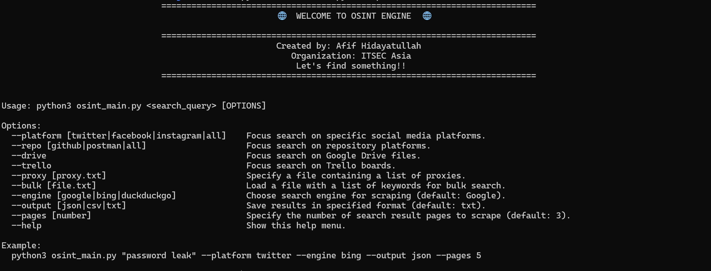
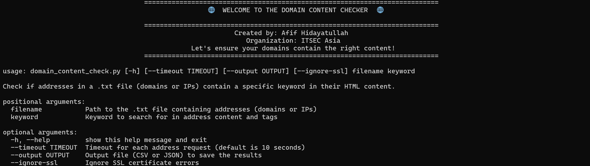

# OSINT Main & Domain Content Checker

Welcome to my OSINT and Web Content Checker tool repository! 🚀

This repository contains two powerful tools designed for Open-Source Intelligence (OSINT) and web content validation. Whether you're investigating social media, websites, or specific domains, these tools will provide you with the insights and data you're looking for.

---

## 🔍 OSINT Main
The `osint_main` tool enhances your OSINT capabilities by scraping data from multiple sources, including social media platforms and search engines. It is ideal for researchers, security analysts, and anyone needing to gather large amounts of public data across the web.

### Key Features:
- Scrapes multiple platforms such as:
  - Twitter
  - Instagram
  - Facebook
  - GitHub
  - Trello
  - Google Drive
- Performs bulk keyword searches.
- Supports multiple search engines (Google, Bing, DuckDuckGo) to maximize data collection.
- Provides customizable output formats (CSV, JSON).

### Example Usage:
```bash
python osint_main.py "keyword1,keyword2" --output results.csv
```



---

## 🌐 Domain Content Checker

The `domain_content_checker` tool is designed to analyze web domains or IP addresses, checking for the presence of specific keywords within their HTML content. It supports multiple protocols and includes detailed keyword search results across various HTML tags.

### Key Features:
- Reads domains or IPs from a `.txt` file and checks for specific keywords.
- Supports both HTTP and HTTPS requests.
- Can ignore SSL certificate errors using the `--ignore-ssl` option.
- Provides detailed keyword search results, showing where the keyword was found (e.g., `<title>`, ``, `<meta>`, `etc`).
- Offers CSV and JSON output formats for easy reporting and data analysis.

### Example Usage:
```bash
python domain_content_checker.py domains.txt "keyword" --output results.json --ignore-ssl
```



**NOTE** PLEASE REMOVE HTTPS:// AND HTTP:// PROTOCOL IF YOU WANT TO CHECK CONTENT FROM DOMAIN THAT YOU FOUND
---

## 🛠️ Requirements

Both tools require Python 3.x and a few essential Python libraries and Install the chrome browser to ensure selenium runs properly. You can install them by running the following command:

```bash
pip install -r requirements.txt
```

### Required Libraries:
- `argparse`
- `requests`
- `beautifulsoup4`

---

## 📦 Installation

1. Clone this repository:
```bash
git clone https://github.com/threatlabindonesia/INTELL-OSINT-AND-CONTENT-CHECKER.git
```

2. Navigate to the directory:
```bash
cd INTELL-OSINT-AND-CONTENT-CHECKER
```

3. Install the necessary libraries:
```bash
pip install -r requirements.txt
```

---

## 📝 License & Usage Terms
These tools are free to download and use by anyone. However, any redistribution, or copying without permission is considered copyright infringement. If you would like to contribute or develop please email.

---

## 👨‍💻 Created By

**Afif Hidayatullah**  
Organization: **ITSEC Asia**
Division: **DFIR and THREAT Hunting**

---

## 📄 Contact

For any inquiries, you can reach me at afif@itsecasia.com.
